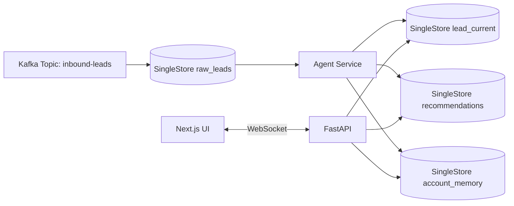

# Realtime Lead Enrichment with SingleStore

This demo shows a full-stack, realtime lead enrichment workflow using SingleStore as the unified data engine. Leads arrive over Kafka, are enriched by an AI agent using vector search + LLM reasoning, and the UI updates instantly.

## Architecture



## Quick Start (Docker Compose)

```bash
docker compose up --build
```

Services:
- SingleStore: `localhost:3306`
- Redpanda (Kafka): `localhost:9092`
- API: `http://localhost:8000`
- UI: `http://localhost:3000`

## Manual Setup

1. Start SingleStore and Redpanda.
2. Run `schema/init.sql` against SingleStore.
3. Build and run `agent`, `api`, `generator`, and `ui`.

## Demo Walkthrough

1. Open the dashboard at `http://localhost:3000`.
2. Click **Simulate lead** to insert a lead manually.
3. Watch the status change to `enriched` as the agent updates fields.
4. Open a lead detail view to see scores, rationale, and similar accounts.

## Kafka Pipeline (Optional)

The schema includes an example `CREATE PIPELINE` for Kafka. If you want Kafka to populate `raw_leads` directly, uncomment the pipeline in `schema/init.sql` or run it manually:

```sql
CREATE OR REPLACE PIPELINE leads_pipeline
AS LOAD DATA KAFKA 'redpanda:9092/inbound-leads'
INTO TABLE raw_leads
FORMAT JSON
(
  lead_id <- lead_id,
  email <- email,
  name <- name,
  company <- company,
  title <- title,
  source <- source,
  form_data <- form_data,
  raw_payload <- @raw
);
START PIPELINE leads_pipeline;
```

When the Kafka pipeline is enabled, set `GENERATOR_DB_WRITE=false` to avoid inserting the same lead twice.

## Configuration

Environment variables used by services:

```
SINGLESTORE_HOST=
SINGLESTORE_PORT=3306
SINGLESTORE_USER=
SINGLESTORE_PASSWORD=
SINGLESTORE_DATABASE=leads_demo
KAFKA_BOOTSTRAP_SERVERS=
OPENAI_API_KEY=
OPENAI_MODEL=gpt-4o-mini
POLL_INTERVAL_SECONDS=4
GENERATOR_INTERVAL_SECONDS=3
GENERATOR_DB_WRITE=true
```

## UI Notes

- Realtime updates are delivered via WebSocket.
- Freshness badges update based on `updated_at`.
- Latency is shown as the time between `created_at` and `enriched_at`.

## Screenshots / GIFs

Add screenshots of the dashboard, lead detail view, and live updates here.
